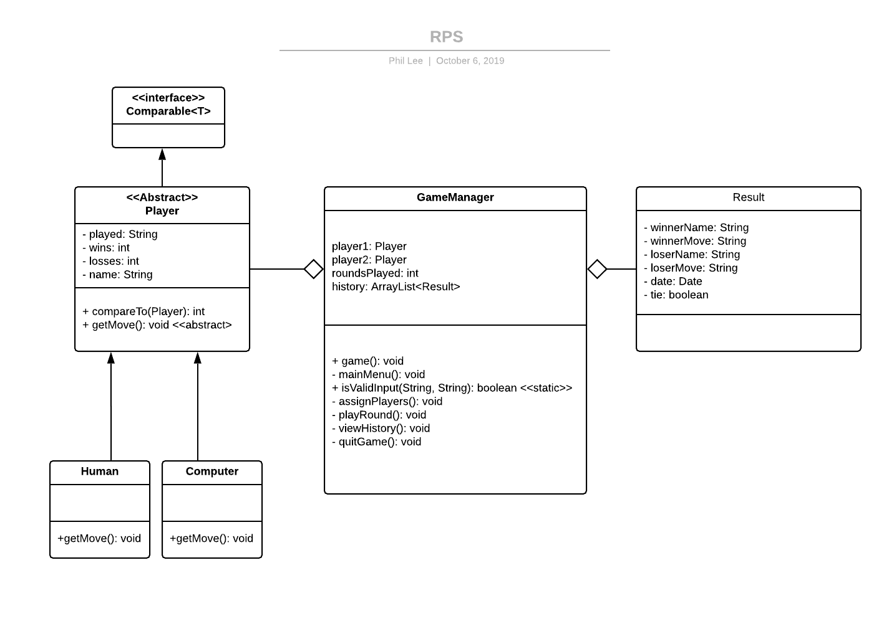

# Project: Rock, Paper, Scissor

**Author**: Phil Lee

## Class Diagram

## Technical Requirements

**1) Use classes to remove repetitive parts of code, and create an abstract Player class to manage the state of the player (if they won or lost, how many points they have, what move they made).**

Application has been developed using OOP, refer to the class diagram above.

**2) Handle invalid user input.**

A static Validator class was used to handle all input validation.

**3) Handle incorrect capitalization of otherwise valid user input ("rock," "Rock," "RoCk," "ROCK," and more).**

equalsIgnoreCase() was used on all validation.

**4) Each class (including a Player class) should have methods associated with it and be instantiated as an object (as opposed to a singleton or an interface).**

All methods are associated with a class. The GameManager is the primary class running the game, the main method will intantiate a GameManager object and call the game() method, which will use various helper methods to run the game.

**5) Use public, private, and static variables, methods, and members within each class appropriately.**

Refer to the class diagram above.

**6) Incorporate exception handling to make sure your game crashes gracefully if it receives bad input.**

try-catch-finally was used to determine if the game history list was null prior to printing out the result or adding to it. If the list was null, the catch block will initialize a new list.

**7) Get standard input with Java using a Scanner, or use Processing to get mouse, keyboard, or other input.**

Scanner was used to retrieve user input and scanner was closed once the user inputs 'quit' during the main menu.

**8) Use arrays or array lists to store game history (if applicable).**

ArrayList was utilized to keep track of the game history.
